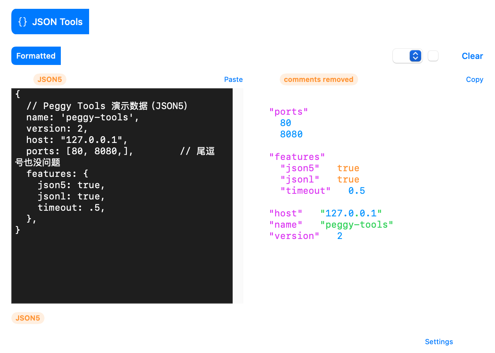
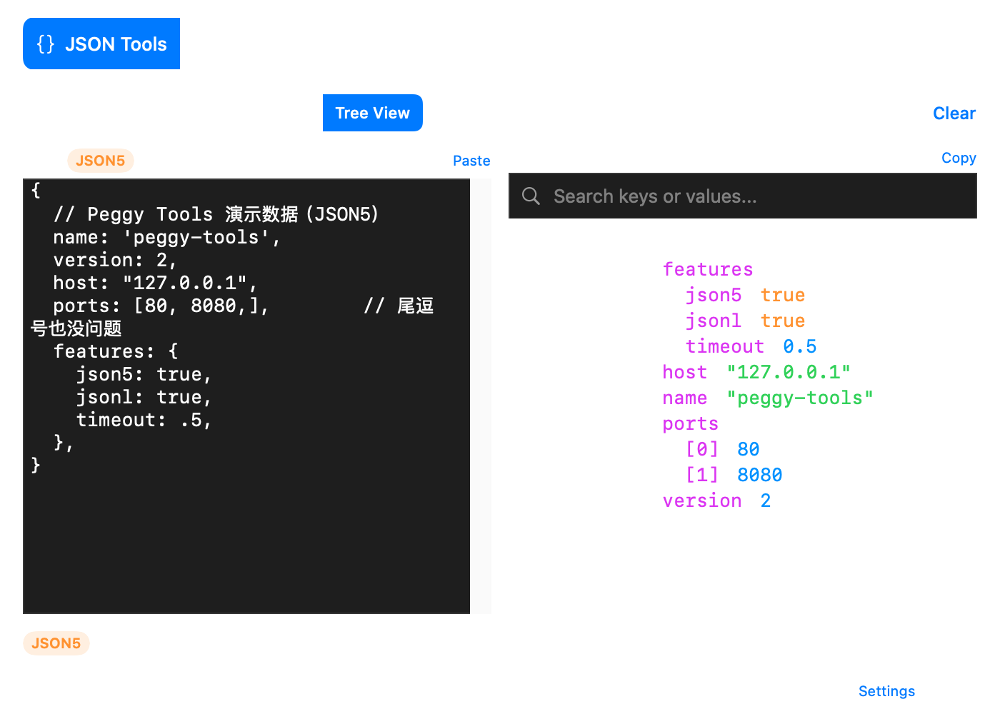

# Peggy Tools

macOS 小工具集（SwiftUI + Swift Package Manager），菜单栏常驻 + 主窗口，支持全局快捷键唤起。

## 界面预览

### JSON Tools — JSON5 自动识别与格式化

输入含注释、单引号、裸 key、尾逗号的 JSON5，自动识别并格式化为标准 JSON（带语法高亮与状态栏统计）：



### 树形视图

解析后的层级结构浏览，支持关键字搜索：



> 截图由应用自带的演示模式生成：`PeggyTools --demo` / `--demo-tree` 预填示例数据，
> `--screenshot <path>` 离屏导出主窗口为 PNG 后自动退出。

## 构建 & 运行

```bash
swift run            # 开发调试
swift build -c release && swift test   # 发布构建 + 测试
```

## 下载安装

从 [Releases](https://github.com/DeanWanghewei/peggy-tools/releases) 下载最新版的 `PeggyTools-<version>.dmg`，打开后将 **Peggy Tools** 拖入「应用程序」。

- 系统要求 macOS 13+，安装包为 arm64 + x86_64 通用二进制
- 应用为 ad-hoc 签名：首次打开若被 Gatekeeper 拦截，右键点击应用 →「打开」→ 再点「打开」
- 全局快捷键与剪贴板功能需要按设置页提示授予辅助功能权限

## 版本与发布

版本号以 git tag 为唯一来源（`vX.Y.Z`），并自动注入应用界面（底部状态栏）与安装包 Info.plist。发版只需：

```bash
git tag -a v1.2.0 -m "Peggy Tools v1.2.0"
git push origin v1.2.0
```

推送 tag 后 GitHub Actions 自动完成：运行测试 → 构建通用二进制 → 组装 .app 并签名 → 产出 zip + dmg → 创建 GitHub Release（含安装说明）。

本地复现完整打包流程：`./scripts/package-app.sh <version>`（产物输出到 `dist/`）。

## 项目结构

```
PeggyTools/
├── App/                     # 应用入口与窗口（App、AppDelegate、ContentView、Settings）
├── Core/                    # 工具插件系统（协议、注册表、通用 UI 组件）
│   ├── Tool.swift           # Tool 协议 + ToolCategory 分类
│   ├── ToolRegistry.swift   # 工具注册表（加工具只改这里）
│   └── Components/          # 通用组件：InputPanel / OutputPanel / ToolbarButton / TextBadge 等
├── Features/                # ★ 每个工具一个自包含目录
│   ├── JSONTools/           #   定义 + 视图 + 子视图
│   └── JSONConverter/
├── Services/                # 领域逻辑（JSONService、JSON5Service、ClipboardService）
├── ViewModels/              # 共享 ViewModel
└── Utils/                   # 扩展
```

主界面 Tab 栏与内容区完全由 `ToolRegistry` 驱动，与具体工具零耦合。

### JSON Tools 支持的输入格式

| 格式 | 自动识别条件 | 行为 |
| --- | --- | --- |
| JSON | 标准 JSON | 格式化 / 压缩 / 校验 / 树形视图 |
| JSON5 | 含注释、尾逗号、单引号、裸 key、十六进制等宽松语法 | 先规范化再处理（注释会移除） |
| JSONL | ≥2 行且每行都是合法 JSON/JSON5 | 逐行处理；Minify 保持每行一个文档；树形视图以数组展示 |

输入区右上角有格式徽章实时提示识别结果；JSONL 的坏行会精确报告行号。

## 添加新工具（两步）

以添加一个 Base64 工具为例：

**1. 在 `Features/` 下建目录，写视图和定义：**

```
Features/Base64/
├── Base64Definition.swift   # 遵守 Tool 协议的元数据 + 视图工厂
└── Base64View.swift         # 工具界面（可直接复用 Core 里的 InputPanel/OutputPanel）
```

```swift
// Base64Definition.swift
import SwiftUI

struct Base64Definition: Tool {
    let id = "base64"                        // 唯一标识
    let name = "Base64"                      // Tab 显示名
    let description = "Encode / decode Base64"
    let systemImage = "lock"                 // SF Symbol
    let category: ToolCategory = .encoding   // 分类（Encoding/Text/Developer/JSON）

    func makeView() -> AnyView {
        AnyView(Base64View())
    }
}
```

**2. 在 `ToolRegistry.allTools` 追加一行：**

```swift
static let allTools: [any Tool] = [
    JSONToolsDefinition(),
    JSONConverterDefinition(),
    Base64Definition(),        // ← 新增
]
```

完成。Tab 栏、内容区会自动渲染新工具，无需改动任何其他文件（SPM 按目录自动收集源码，也不用改 Package.swift）。

### 约定

- 业务逻辑放 `Services/`（纯函数、可单测），视图状态放 ViewModel，视图只做渲染
- 输入/输出类工具优先复用 `Core/Components/CommonStyles.swift` 里的 `InputPanel`、`OutputPanel`、`ToolbarButton`、`SegmentedPicker`
- 新增分类时在 `ToolCategory` 里加 case 即可
